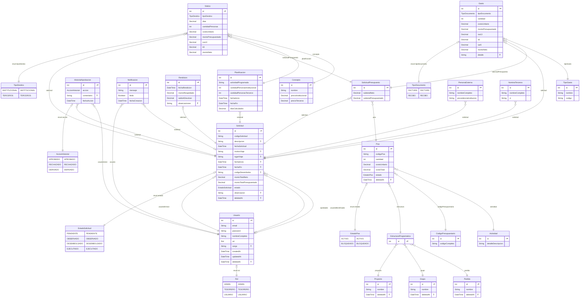

```mermaid
erDiagram

        Rol {
            ADMIN ADMIN
TESORERO TESORERO
USUARIO USUARIO
        }
    


        EstadoSolicitud {
            PENDIENTE PENDIENTE
OBSERVADO OBSERVADO
DESEMBOLSADO DESEMBOLSADO
EJECUTADO EJECUTADO
        }
    


        EstadoPoa {
            ACTIVO ACTIVO
BLOQUEADO BLOQUEADO
        }
    


        AccionHistorial {
            APROBADO APROBADO
RECHAZADO RECHAZADO
DERIVADO DERIVADO
        }
    


        TipoDestino {
            INSTITUCIONAL INSTITUCIONAL
TERCEROS TERCEROS
        }
    


        TipoDocumento {
            FACTURA FACTURA
RECIBO RECIBO
        }
    
  "Usuario" {
    Int id "🗝️"
    String email 
    String password 
    String nombreCompleto 
    Rol rol 
    String cargo "❓"
    DateTime createdAt 
    DateTime updatedAt 
    DateTime deletedAt "❓"
    }
  

  "Proyecto" {
    Int id "🗝️"
    String nombre 
    DateTime deletedAt "❓"
    }
  

  "Grupo" {
    Int id "🗝️"
    String nombre 
    DateTime deletedAt "❓"
    }
  

  "Partida" {
    Int id "🗝️"
    String nombre 
    DateTime deletedAt "❓"
    }
  

  "CodigoPresupuestario" {
    Int id "🗝️"
    String codigoCompleto 
    }
  

  "Actividad" {
    Int id "🗝️"
    String detalleDescripcion 
    }
  

  "EstructuraProgramatica" {
    Int id "🗝️"
    }
  

  "Poa" {
    Int id "🗝️"
    String codigoPoa 
    Int cantidad 
    Decimal costoUnitario 
    Decimal costoTotal 
    EstadoPoa estado 
    DateTime deletedAt "❓"
    }
  

  "Solicitud" {
    Int id "🗝️"
    String codigoSolicitud 
    String descripcion "❓"
    DateTime fechaSolicitud 
    String motivoViaje "❓"
    String lugarViaje "❓"
    DateTime fechaInicio "❓"
    DateTime fechaFin "❓"
    String codigoDesembolso "❓"
    Decimal montoTotalNeto 
    Decimal montoTotalPresupuestado 
    EstadoSolicitud estado 
    String observacion "❓"
    DateTime deletedAt "❓"
    }
  

  "HistorialAprobacion" {
    Int id "🗝️"
    AccionHistorial accion 
    String comentario "❓"
    DateTime fechaAccion 
    }
  

  "Notificacion" {
    Int id "🗝️"
    String mensaje 
    Boolean leido 
    DateTime fechaCreacion 
    }
  

  "Rendicion" {
    Int id "🗝️"
    DateTime fechaRendicion 
    Decimal montoRespaldado 
    Decimal saldoADevolver 
    String observaciones "❓"
    }
  

  "SolicitudPresupuesto" {
    Int id "🗝️"
    Decimal subtotalNeto 
    Decimal subtotalPresupuestado 
    }
  

  "Planificacion" {
    Int id "🗝️"
    String actividadProgramada 
    Int cantidadPersonasInstitucional 
    Int cantidadPersonasTerceros 
    DateTime fechaInicio 
    DateTime fechaFin 
    Decimal diasCalculados 
    }
  

  "Concepto" {
    Int id "🗝️"
    String nombre 
    Decimal precioInstitucional 
    Decimal precioTerceros 
    }
  

  "Viatico" {
    Int id "🗝️"
    TipoDestino tipoDestino 
    Decimal dias 
    Int cantidadPersonas 
    Decimal costoUnitario 
    Decimal montoPresupuestado 
    Decimal iva13 
    Decimal it3 
    Decimal montoNeto 
    }
  

  "TipoGasto" {
    Int id "🗝️"
    String nombre 
    String codigo 
    }
  

  "Gasto" {
    Int id "🗝️"
    TipoDocumento tipoDocumento 
    Int cantidad 
    Decimal costoUnitario 
    Decimal montoPresupuestado 
    Decimal iva13 
    Decimal it3 
    Decimal iue5 
    Decimal montoNeto 
    String detalle "❓"
    }
  

  "PersonaExterna" {
    Int id "🗝️"
    String nombreCompleto 
    String procedenciaInstitucion 
    }
  

  "NominaTerceros" {
    Int id "🗝️"
    String nombreCompleto 
    String ci 
    }
  
    "Usuario" |o--|| "Rol" : "enum:rol"
    "EstructuraProgramatica" }o--|| "Proyecto" : "proyecto"
    "EstructuraProgramatica" }o--|| "Grupo" : "grupo"
    "EstructuraProgramatica" }o--|| "Partida" : "partida"
    "Poa" |o--|| "EstadoPoa" : "enum:estado"
    "Poa" }o--|| "EstructuraProgramatica" : "estructura"
    "Poa" }o--|| "CodigoPresupuestario" : "codigoPresupuestario"
    "Poa" }o--|| "Actividad" : "actividad"
    "Solicitud" |o--|| "EstadoSolicitud" : "enum:estado"
    "Solicitud" }o--|| "Usuario" : "usuarioEmisor"
    "Solicitud" }o--|o "Usuario" : "aprobador"
    "Solicitud" }o--|o "Usuario" : "usuarioBeneficiado"
    "HistorialAprobacion" |o--|| "AccionHistorial" : "enum:accion"
    "HistorialAprobacion" }o--|| "Solicitud" : "solicitud"
    "HistorialAprobacion" }o--|| "Usuario" : "usuarioActor"
    "Notificacion" }o--|| "Usuario" : "usuario"
    "Notificacion" }o--|o "Solicitud" : "solicitud"
    "Rendicion" |o--|| "Solicitud" : "solicitud"
    "SolicitudPresupuesto" }o--|| "Solicitud" : "solicitud"
    "SolicitudPresupuesto" }o--|| "Poa" : "poa"
    "Planificacion" }o--|| "Solicitud" : "solicitud"
    "Viatico" |o--|| "TipoDestino" : "enum:tipoDestino"
    "Viatico" }o--|| "Solicitud" : "solicitud"
    "Viatico" }o--|| "SolicitudPresupuesto" : "solicitudPresupuesto"
    "Viatico" }o--|| "Planificacion" : "planificacion"
    "Viatico" }o--|| "Concepto" : "concepto"
    "Gasto" |o--|| "TipoDocumento" : "enum:tipoDocumento"
    "Gasto" }o--|| "Solicitud" : "solicitud"
    "Gasto" }o--|| "SolicitudPresupuesto" : "solicitudPresupuesto"
    "Gasto" }o--|| "TipoGasto" : "tipoGasto"
    "PersonaExterna" }o--|| "Solicitud" : "solicitud"
    "NominaTerceros" }o--|| "Solicitud" : "solicitud"
```
