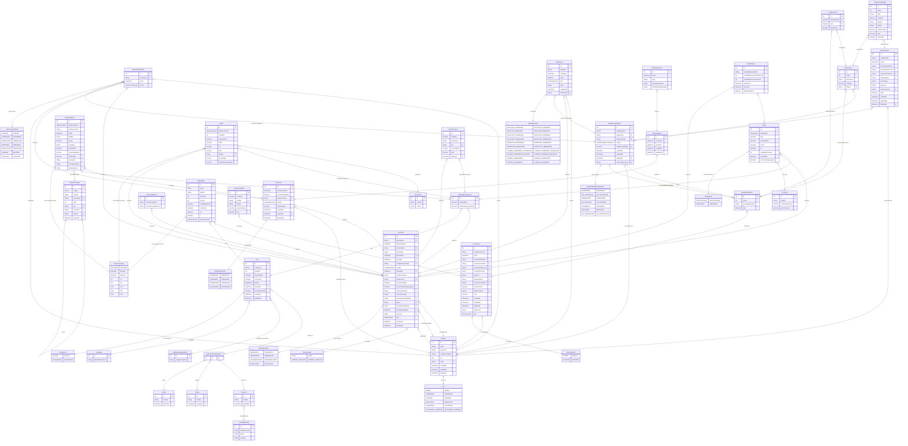

```mermaid
erDiagram

        Rol {
            ADMIN ADMIN
TESORERO TESORERO
USUARIO USUARIO
EJECUTIVO EJECUTIVO
CONTADOR CONTADOR
VALIDADOR_COMPRAS VALIDADOR_COMPRAS
        }
    


        EstadoSolicitud {
            PENDIENTE PENDIENTE
OBSERVADO OBSERVADO
DESEMBOLSADO DESEMBOLSADO
EJECUTADO EJECUTADO
        }
    


        TipoSolicitud {
            VIAJE VIAJE
COMPRA_SERVICIO COMPRA_SERVICIO
        }
    


        EstadoPoa {
            ACTIVO ACTIVO
BLOQUEADO BLOQUEADO
        }
    


        TipoAccionHistorial {
            CREADO CREADO
APROBADO APROBADO
OBSERVADO OBSERVADO
DERIVADO DERIVADO
RECHAZADO RECHAZADO
ENVIADO ENVIADO
VALIDADO VALIDADO
        }
    


        TipoDestino {
            INSTITUCIONAL INSTITUCIONAL
TERCEROS TERCEROS
        }
    


        TipoDocumento {
            FACTURA FACTURA
RECIBO RECIBO
BOLETA BOLETA
LV LV
DJ DJ
PPT PPT
PAT PAT
PVT PVT
        }
    


        EstadoRendicion {
            PENDIENTE PENDIENTE
APROBADO APROBADO
OBSERVADO OBSERVADO
RECHAZADO RECHAZADO
        }
    


        TipoNotificacion {
            SOLICITUD_ASIGNADA SOLICITUD_ASIGNADA
SOLICITUD_DERIVADA SOLICITUD_DERIVADA
SOLICITUD_APROBADA SOLICITUD_APROBADA
SOLICITUD_OBSERVADA SOLICITUD_OBSERVADA
RENDICION_PENDIENTE RENDICION_PENDIENTE
RENDICION_OBSERVADA RENDICION_OBSERVADA
CUADRO_PENDIENTE_VALIDACION CUADRO_PENDIENTE_VALIDACION
CUADRO_PENDIENTE_REVISION CUADRO_PENDIENTE_REVISION
CUADRO_OBSERVADO CUADRO_OBSERVADO
CUADRO_APROBADO CUADRO_APROBADO
        }
    


        TipoCotizacion {
            PROPIA PROPIA
EXTERNA EXTERNA
        }
    


        EstadoCuadroComparativo {
            BORRADOR BORRADOR
EN_VALIDACION EN_VALIDACION
OBSERVADO OBSERVADO
EN_REVISION EN_REVISION
APROBADO APROBADO
REVISADO REVISADO
EN_APROBACION EN_APROBACION
        }
    
  "Usuario" {
    Int id "🗝️"
    String email 
    String password 
    String nombreCompleto 
    Rol rol 
    String cargo "❓"
    DateTime createdAt 
    DateTime updatedAt 
    DateTime deletedAt "❓"
    }
  

  "Proyecto" {
    Int id "🗝️"
    String nombre 
    DateTime deletedAt "❓"
    }
  

  "Grupo" {
    Int id "🗝️"
    String nombre 
    DateTime deletedAt "❓"
    }
  

  "Partida" {
    Int id "🗝️"
    String nombre 
    DateTime deletedAt "❓"
    }
  

  "CodigoPresupuestario" {
    Int id "🗝️"
    String codigoCompleto 
    }
  

  "Actividad" {
    Int id "🗝️"
    String detalleDescripcion 
    }
  

  "EstructuraProgramatica" {
    Int id "🗝️"
    }
  

  "Poa" {
    Int id "🗝️"
    String codigoPoa 
    Int cantidad 
    Decimal costoUnitario 
    Decimal costoTotal 
    EstadoPoa estado 
    DateTime deletedAt "❓"
    Decimal montoEjecutado 
    DateTime createdAt 
    DateTime updatedAt 
    }
  

  "Solicitud" {
    Int id "🗝️"
    String descripcion "❓"
    DateTime fechaSolicitud 
    String motivoViaje "❓"
    String lugarViaje "❓"
    DateTime fechaInicio "❓"
    DateTime fechaFin "❓"
    String codigoDesembolso "❓"
    EstadoSolicitud estado 
    DateTime deletedAt "❓"
    String codigoSolicitud 
    String observacion "❓"
    Decimal montoTotalNeto 
    Decimal montoTotalPresupuestado 
    String urlComprobante "❓"
    String urlCotizaciones 
    String urlCuadroComparativo "❓"
    String banco "❓"
    String chequeANombreDe "❓"
    DateTime fechaDesembolso "❓"
    String proyecto "❓"
    TipoSolicitud tipo 
    DateTime createdAt 
    DateTime updatedAt 
    }
  

  "HistorialAprobacion" {
    Int id "🗝️"
    String comentario "❓"
    DateTime fecha 
    TipoAccionHistorial accion 
    }
  

  "Notificacion" {
    Int id "🗝️"
    String mensaje 
    DateTime createdAt 
    Boolean leida 
    TipoNotificacion tipo 
    String titulo 
    DateTime updatedAt 
    String urlDestino "❓"
    }
  

  "Rendicion" {
    Int id "🗝️"
    DateTime fechaRendicion 
    Decimal montoRespaldado 
    String observaciones "❓"
    EstadoRendicion estado 
    Decimal saldoLiquido 
    DateTime createdAt 
    DateTime deletedAt "❓"
    DateTime updatedAt 
    }
  

  "InformeGastos" {
    Int id "🗝️"
    DateTime fechaInicio 
    DateTime fechaFin 
    DateTime createdAt 
    DateTime updatedAt 
    }
  

  "ActividadInforme" {
    Int id "🗝️"
    DateTime fecha 
    String lugar 
    String personaInstitucion 
    String actividadesRealizadas 
    }
  

  "GastoRendicion" {
    Int id "🗝️"
    TipoDocumento tipoDocumento 
    String nroDocumento 
    DateTime fecha 
    String detalle 
    Decimal monto 
    String concepto 
    Decimal montoBruto 
    Decimal montoImpuestos 
    Decimal montoNeto 
    String proveedor "❓"
    String urlComprobante 
    String tipoRetencion "❓"
    }
  

  "SolicitudPresupuesto" {
    Int id "🗝️"
    Decimal subtotalNeto 
    Decimal subtotalPresupuestado 
    }
  

  "Planificacion" {
    Int id "🗝️"
    String actividadProgramada 
    Int cantidadPersonasInstitucional 
    Int cantidadPersonasTerceros 
    DateTime fechaInicio 
    DateTime fechaFin 
    Decimal diasCalculados 
    }
  

  "Concepto" {
    Int id "🗝️"
    String nombre 
    Decimal precioInstitucional 
    Decimal precioTerceros 
    }
  

  "Viatico" {
    Int id "🗝️"
    TipoDestino tipoDestino 
    Decimal dias 
    Decimal costoUnitario 
    Decimal iva13 
    Decimal it3 
    Int cantidadPersonas 
    Decimal montoNeto 
    Decimal montoPresupuestado 
    }
  

  "TipoGasto" {
    Int id "🗝️"
    String nombre 
    String codigo 
    }
  

  "Gasto" {
    Int id "🗝️"
    TipoDocumento tipoDocumento 
    Int cantidad 
    Decimal costoUnitario 
    Decimal iva13 
    Decimal it3 
    Decimal iue5 
    String detalle "❓"
    Decimal montoNeto 
    Decimal montoPresupuestado 
    }
  

  "PersonaExterna" {
    Int id "🗝️"
    String nombreCompleto 
    String procedenciaInstitucion 
    }
  

  "GastoCompra" {
    Int id "🗝️"
    Decimal cantidad 
    String descripcion 
    String uso "❓"
    Decimal costoUnitario 
    Decimal total 
    DateTime deletedAt "❓"
    }
  

  "CuentaBancaria" {
    Int id "🗝️"
    String numeroCuenta 
    String banco 
    String moneda 
    }
  

  "Hospedaje" {
    Int id "🗝️"
    String region 
    String destino 
    Int personas 
    Int noches 
    Decimal cantidadUnitaria 
    Decimal costoTotal 
    Decimal iva 
    Decimal it 
    TipoDocumento tipoDocumento 
    }
  

  "Cotizacion" {
    Int id "🗝️"
    String codigoCotizacion 
    DateTime fecha 
    String proveedorNombre 
    String proveedorTelefono "❓"
    String proveedorDireccion "❓"
    String proveedorCorreo "❓"
    String garantia "❓"
    String disponibilidad "❓"
    String duracionCotizacion "❓"
    Boolean emiteFactura 
    String observaciones "❓"
    Decimal total 
    DateTime createdAt 
    DateTime updatedAt 
    DateTime deletedAt "❓"
    String adjuntoUrl "❓"
    TipoCotizacion tipo 
    }
  

  "LineaCotizacion" {
    Int id "🗝️"
    Decimal cantidad 
    String unidad "❓"
    String detalle 
    Decimal precioUnitario 
    Decimal total 
    }
  

  "CuadroComparativo" {
    Int id "🗝️"
    String codigoCuadro 
    String lugarFecha "❓"
    String observaciones "❓"
    EstadoCuadroComparativo estado 
    Decimal totalRecomendado "❓"
    DateTime createdAt 
    DateTime updatedAt 
    DateTime deletedAt "❓"
    String motivoObservacion "❓"
    }
  

  "CuadroCotizacion" {
    Int id "🗝️"
    Int orden 
    String proveedorNombre 
    Decimal total 
    }
  

  "CuadroItem" {
    Int id "🗝️"
    Int orden 
    String descripcion 
    Decimal cantidad 
    String unidad "❓"
    }
  

  "CuadroPrecio" {
    Int id "🗝️"
    Decimal precioUnitario "❓"
    Decimal total "❓"
    Boolean noMenciona 
    }
  

  "OrdenCompra" {
    Int id "🗝️"
    String codigoOrden 
    DateTime fecha 
    String proveedorNombre 
    String proveedorDireccion "❓"
    String proveedorTelefono "❓"
    String lugarEntrega "❓"
    String formaPago 
    String garantia 
    String observaciones "❓"
    Decimal total 
    DateTime createdAt 
    DateTime updatedAt 
    DateTime deletedAt "❓"
    }
  

  "OrdenCompraItem" {
    Int id "🗝️"
    Int orden 
    String item 
    Decimal cantidad 
    String unidad "❓"
    String detalle "❓"
    Decimal precioUnitario 
    Decimal total 
    Boolean sinCuadro 
    }
  

  "PartidaContable" {
    Int id "🗝️"
    String codigo 
    String nombre 
    String descripcion "❓"
    Int nivel 
    String tipo "❓"
    String monetaria "❓"
    String auxiliar "❓"
    DateTime deletedAt "❓"
    }
  
    "Usuario" |o--|| "Rol" : "enum:rol"
    "Proyecto" }o--|o "CuentaBancaria" : "cuentaBancaria"
    "EstructuraProgramatica" }o--|| "Grupo" : "grupo"
    "EstructuraProgramatica" }o--|| "Partida" : "partida"
    "EstructuraProgramatica" }o--|| "Proyecto" : "proyecto"
    "Poa" |o--|| "EstadoPoa" : "enum:estado"
    "Poa" }o--|| "Actividad" : "actividad"
    "Poa" }o--|| "CodigoPresupuestario" : "codigoPresupuestario"
    "Poa" }o--|| "EstructuraProgramatica" : "estructura"
    "Solicitud" |o--|| "EstadoSolicitud" : "enum:estado"
    "Solicitud" |o--|| "TipoSolicitud" : "enum:tipo"
    "Solicitud" }o--|o "Usuario" : "aprobador"
    "Solicitud" }o--|o "Usuario" : "usuarioBeneficiado"
    "Solicitud" }o--|| "Usuario" : "usuarioEmisor"
    "HistorialAprobacion" |o--|| "TipoAccionHistorial" : "enum:accion"
    "HistorialAprobacion" }o--|o "CuadroComparativo" : "cuadroComparativo"
    "HistorialAprobacion" }o--|o "Usuario" : "derivadoA"
    "HistorialAprobacion" }o--|o "Rendicion" : "rendicion"
    "HistorialAprobacion" }o--|o "Solicitud" : "solicitud"
    "HistorialAprobacion" }o--|| "Usuario" : "usuario"
    "Notificacion" |o--|| "TipoNotificacion" : "enum:tipo"
    "Notificacion" }o--|o "CuadroComparativo" : "cuadroComparativo"
    "Notificacion" }o--|o "Solicitud" : "solicitud"
    "Notificacion" }o--|| "Usuario" : "usuario"
    "Rendicion" |o--|| "EstadoRendicion" : "enum:estado"
    "Rendicion" }o--|o "Usuario" : "aprobadorActual"
    "Rendicion" |o--|| "Solicitud" : "solicitud"
    "InformeGastos" |o--|| "Rendicion" : "rendicion"
    "ActividadInforme" }o--|| "InformeGastos" : "informe"
    "GastoRendicion" |o--|| "TipoDocumento" : "enum:tipoDocumento"
    "GastoRendicion" }o--|o "PartidaContable" : "partidaContable"
    "GastoRendicion" }o--|o "SolicitudPresupuesto" : "partida"
    "GastoRendicion" }o--|| "Rendicion" : "rendicion"
    "SolicitudPresupuesto" }o--|| "Poa" : "poa"
    "SolicitudPresupuesto" }o--|| "Solicitud" : "solicitud"
    "Planificacion" }o--|| "Solicitud" : "solicitud"
    "Planificacion" o{--}o "Viatico" : ""
    "Viatico" |o--|| "TipoDestino" : "enum:tipoDestino"
    "Viatico" }o--|| "Concepto" : "concepto"
    "Viatico" }o--|| "Solicitud" : "solicitud"
    "Viatico" }o--|| "SolicitudPresupuesto" : "solicitudPresupuesto"
    "Gasto" |o--|| "TipoDocumento" : "enum:tipoDocumento"
    "Gasto" }o--|| "Solicitud" : "solicitud"
    "Gasto" }o--|| "SolicitudPresupuesto" : "solicitudPresupuesto"
    "Gasto" }o--|| "TipoGasto" : "tipoGasto"
    "PersonaExterna" }o--|| "Solicitud" : "solicitud"
    "GastoCompra" }o--|| "Solicitud" : "solicitud"
    "GastoCompra" }o--|| "SolicitudPresupuesto" : "solicitudPresupuesto"
    "Hospedaje" |o--|| "TipoDocumento" : "enum:tipoDocumento"
    "Hospedaje" }o--|| "Poa" : "poa"
    "Hospedaje" }o--|| "Solicitud" : "solicitud"
    "Cotizacion" |o--|| "TipoCotizacion" : "enum:tipo"
    "Cotizacion" }o--|| "Usuario" : "usuarioEmisor"
    "LineaCotizacion" }o--|| "Cotizacion" : "cotizacion"
    "CuadroComparativo" |o--|| "EstadoCuadroComparativo" : "enum:estado"
    "CuadroComparativo" }o--|o "CuadroCotizacion" : "cotizacionRecomendada"
    "CuadroComparativo" }o--|| "Usuario" : "usuarioEmisor"
    "CuadroCotizacion" }o--|| "Cotizacion" : "cotizacion"
    "CuadroCotizacion" }o--|| "CuadroComparativo" : "cuadro"
    "CuadroItem" }o--|o "CuadroCotizacion" : "cotizacionGanadora"
    "CuadroItem" }o--|| "CuadroComparativo" : "cuadro"
    "CuadroPrecio" }o--|| "CuadroCotizacion" : "cuadroCotizacion"
    "CuadroPrecio" }o--|| "CuadroItem" : "cuadroItem"
    "OrdenCompra" }o--|o "CuadroComparativo" : "cuadroComparativo"
    "OrdenCompra" }o--|| "Usuario" : "usuarioEmisor"
    "OrdenCompraItem" }o--|o "CuadroItem" : "cuadroItem"
    "OrdenCompraItem" }o--|| "OrdenCompra" : "ordenCompra"
    "PartidaContable" |o--|o "PartidaContable" : "parent"
```
