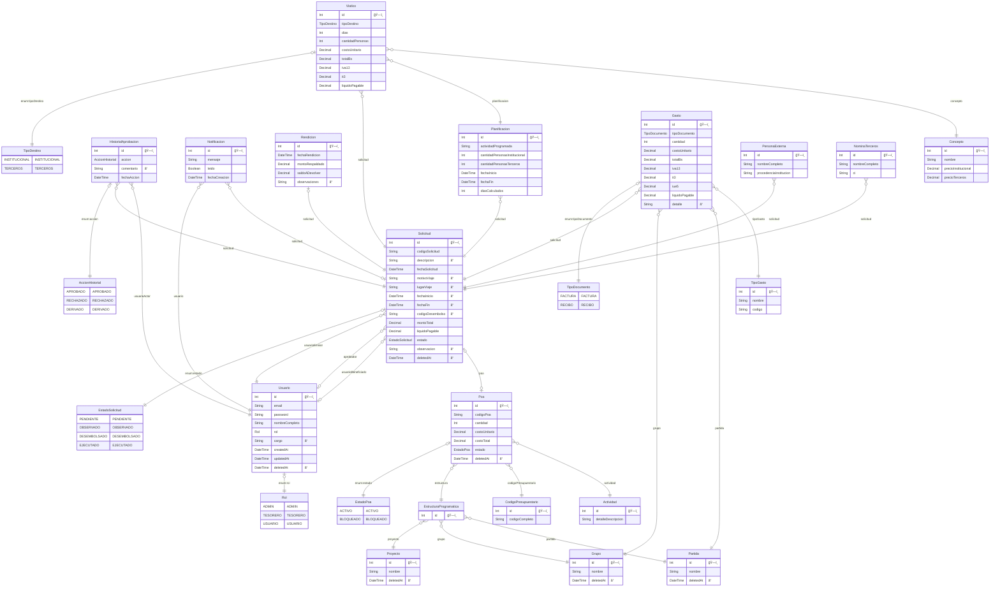

```mermaid
erDiagram

        Rol {
            ADMIN ADMIN
TESORERO TESORERO
USUARIO USUARIO
        }
    


        EstadoSolicitud {
            PENDIENTE PENDIENTE
OBSERVADO OBSERVADO
DESEMBOLSADO DESEMBOLSADO
EJECUTADO EJECUTADO
        }
    


        EstadoPoa {
            ACTIVO ACTIVO
BLOQUEADO BLOQUEADO
        }
    


        AccionHistorial {
            APROBADO APROBADO
RECHAZADO RECHAZADO
DERIVADO DERIVADO
        }
    


        TipoDestino {
            INSTITUCIONAL INSTITUCIONAL
TERCEROS TERCEROS
        }
    


        TipoDocumento {
            FACTURA FACTURA
RECIBO RECIBO
        }
    
  "Usuario" {
    Int id "ğŸ—ï¸"
    String email 
    String password 
    String nombreCompleto 
    Rol rol 
    String cargo "â“"
    DateTime createdAt 
    DateTime updatedAt 
    DateTime deletedAt "â“"
    }
  

  "Proyecto" {
    Int id "ğŸ—ï¸"
    String nombre 
    DateTime deletedAt "â“"
    }
  

  "Grupo" {
    Int id "ğŸ—ï¸"
    String nombre 
    DateTime deletedAt "â“"
    }
  

  "Partida" {
    Int id "ğŸ—ï¸"
    String nombre 
    DateTime deletedAt "â“"
    }
  

  "CodigoPresupuestario" {
    Int id "ğŸ—ï¸"
    String codigoCompleto 
    }
  

  "Actividad" {
    Int id "ğŸ—ï¸"
    String detalleDescripcion 
    }
  

  "EstructuraProgramatica" {
    Int id "ğŸ—ï¸"
    }
  

  "Poa" {
    Int id "ğŸ—ï¸"
    String codigoPoa 
    Int cantidad 
    Decimal costoUnitario 
    Decimal costoTotal 
    EstadoPoa estado 
    DateTime deletedAt "â“"
    }
  

  "Solicitud" {
    Int id "ğŸ—ï¸"
    String codigoSolicitud 
    String descripcion "â“"
    DateTime fechaSolicitud 
    String motivoViaje "â“"
    String lugarViaje "â“"
    DateTime fechaInicio "â“"
    DateTime fechaFin "â“"
    String codigoDesembolso "â“"
    Decimal montoTotal 
    Decimal liquidoPagable 
    EstadoSolicitud estado 
    String observacion "â“"
    DateTime deletedAt "â“"
    }
  

  "HistorialAprobacion" {
    Int id "ğŸ—ï¸"
    AccionHistorial accion 
    String comentario "â“"
    DateTime fechaAccion 
    }
  

  "Notificacion" {
    Int id "ğŸ—ï¸"
    String mensaje 
    Boolean leido 
    DateTime fechaCreacion 
    }
  

  "Rendicion" {
    Int id "ğŸ—ï¸"
    DateTime fechaRendicion 
    Decimal montoRespaldado 
    Decimal saldoADevolver 
    String observaciones "â“"
    }
  

  "Planificacion" {
    Int id "ğŸ—ï¸"
    String actividadProgramada 
    Int cantidadPersonasInstitucional 
    Int cantidadPersonasTerceros 
    DateTime fechaInicio 
    DateTime fechaFin 
    Int diasCalculados 
    }
  

  "Concepto" {
    Int id "ğŸ—ï¸"
    String nombre 
    Decimal precioInstitucional 
    Decimal precioTerceros 
    }
  

  "Viatico" {
    Int id "ğŸ—ï¸"
    TipoDestino tipoDestino 
    Int dias 
    Int cantidadPersonas 
    Decimal costoUnitario 
    Decimal totalBs 
    Decimal iva13 
    Decimal it3 
    Decimal liquidoPagable 
    }
  

  "TipoGasto" {
    Int id "ğŸ—ï¸"
    String nombre 
    String codigo 
    }
  

  "Gasto" {
    Int id "ğŸ—ï¸"
    TipoDocumento tipoDocumento 
    Int cantidad 
    Decimal costoUnitario 
    Decimal totalBs 
    Decimal iva13 
    Decimal it3 
    Decimal iue5 
    Decimal liquidoPagable 
    String detalle "â“"
    }
  

  "PersonaExterna" {
    Int id "ğŸ—ï¸"
    String nombreCompleto 
    String procedenciaInstitucion 
    }
  

  "NominaTerceros" {
    Int id "ğŸ—ï¸"
    String nombreCompleto 
    String ci 
    }
  
    "Usuario" |o--|| "Rol" : "enum:rol"
    "EstructuraProgramatica" }o--|| "Proyecto" : "proyecto"
    "EstructuraProgramatica" }o--|| "Grupo" : "grupo"
    "EstructuraProgramatica" }o--|| "Partida" : "partida"
    "Poa" |o--|| "EstadoPoa" : "enum:estado"
    "Poa" }o--|| "EstructuraProgramatica" : "estructura"
    "Poa" }o--|| "CodigoPresupuestario" : "codigoPresupuestario"
    "Poa" }o--|| "Actividad" : "actividad"
    "Solicitud" |o--|| "EstadoSolicitud" : "enum:estado"
    "Solicitud" }o--|| "Usuario" : "usuarioEmisor"
    "Solicitud" }o--|o "Usuario" : "aprobador"
    "Solicitud" }o--|o "Usuario" : "usuarioBeneficiado"
    "Solicitud" |o--|o "Poa" : "poa"
    "HistorialAprobacion" |o--|| "AccionHistorial" : "enum:accion"
    "HistorialAprobacion" }o--|| "Solicitud" : "solicitud"
    "HistorialAprobacion" }o--|| "Usuario" : "usuarioActor"
    "Notificacion" }o--|| "Usuario" : "usuario"
    "Notificacion" }o--|o "Solicitud" : "solicitud"
    "Rendicion" |o--|| "Solicitud" : "solicitud"
    "Planificacion" }o--|| "Solicitud" : "solicitud"
    "Viatico" |o--|| "TipoDestino" : "enum:tipoDestino"
    "Viatico" }o--|| "Solicitud" : "solicitud"
    "Viatico" }o--|| "Planificacion" : "planificacion"
    "Viatico" }o--|| "Concepto" : "concepto"
    "Gasto" |o--|| "TipoDocumento" : "enum:tipoDocumento"
    "Gasto" }o--|| "Solicitud" : "solicitud"
    "Gasto" }o--|| "Grupo" : "grupo"
    "Gasto" }o--|| "Partida" : "partida"
    "Gasto" }o--|| "TipoGasto" : "tipoGasto"
    "PersonaExterna" }o--|| "Solicitud" : "solicitud"
    "NominaTerceros" }o--|| "Solicitud" : "solicitud"
```
